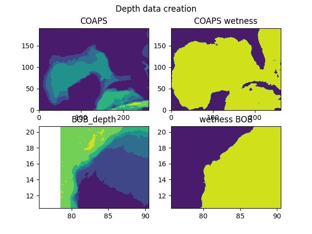
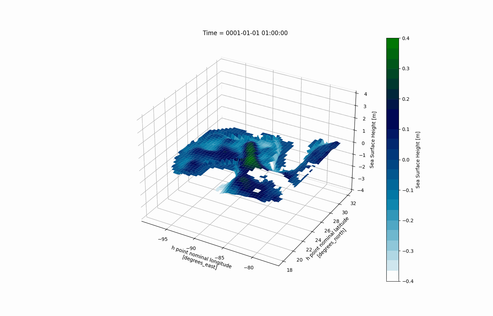

# To do

- [x] - function for masking @forcing
- [ ] - data type of dimension error, create an default template (netcdf Xarray)


# MOM6dev
MOM6 development privat


# wiki

# Datasets

[Current data OSCAR earthdata](https://podaac-tools.jpl.nasa.gov/drive/files/allData/oscar/preview/L4/oscar_third_deg)

[GEBCO bathymetry dataset](https://www.gebco.net/data_and_products/gridded_bathymetry_data/)

[Initial conditions ](https://www.ecmwf.int/en/research/climate-reanalysis/ocean-reanalysis)
  - [hamberg link](https://www.cen.uni-hamburg.de/en/icdc/data/ocean/easy-init-ocean/ecmwf-oras5.html)


# Depth preparation




```python
n_bath = griddata((xf,yf),valsf,(xx[None,:],yy[:,None]),method="linear")
```

```BASH
pandoc phd_propos.md -o proposal_init.pdf --from markdown --template eisvogel --listing
```


# Simulated SSH


