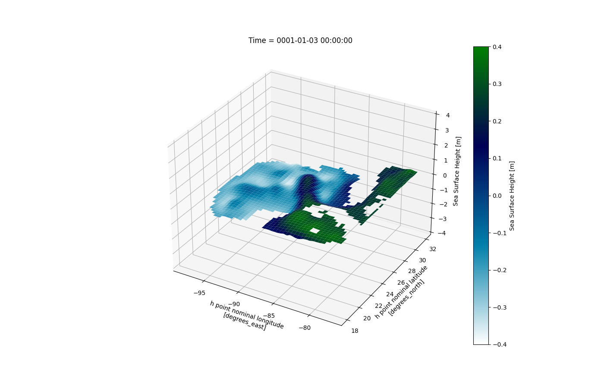

# Test run 

1. COAPS configuration
2. They are not using any forcing datasets

# salinity 
59691812427d5eb53eebd3e90260eaa5483e1ba3

# SST 

# SSH

- sea surface height
  

# vertical 

- 41 levels ( HYCOM)

## salinity 

