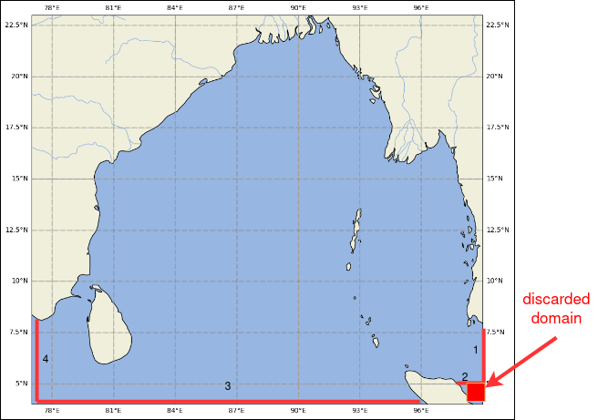

# Setting up open boundary conditions

## To do 

- [ ] Check the COAPS model open boundary locations
  - [ ] Check data files and boundaries
  - [ ] list all the variables we need 

- [ ] Make the 1st boundary closed 
- [ ] make the data points 
