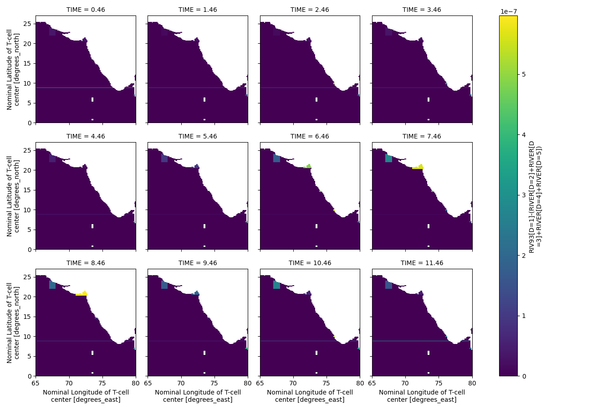
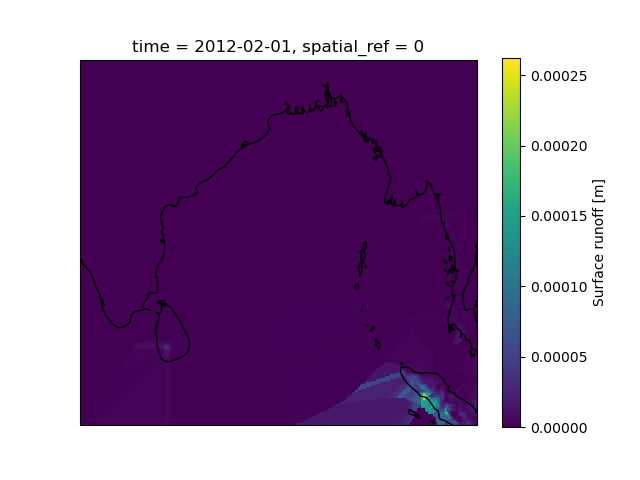
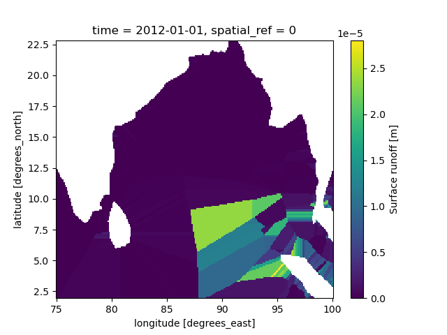

# Steps to reproduce MOM6 runoff input grid system

## Requirements

1. The runoff points in the land should be extended to the ocean
2. need runopff flux (kg/s)/m^2  (currently in mm/sec)
3. So volume should divide by area of spread




# Steps

1. Load the preproceeed datasets 

```python
import xarray as xr

runoff = xr.open_dataset("runoff_final.nc",decode_times=False)


```
> decode_times = False, problem with time axis in xarray (cftime), which refer to this  [issue](https://github.com/nmathewa/MOM6dev/issues/16)

2. Interpolating the nan values (to ocean points) 
   


3. Clipping for ocean only regions

   
   


### To convert volume to flux

1. get cell area 
   #### Using CDO
   ```bash 
   cdo gridarea yourdata.nc gridarea.nc 
   ```
   #### script

   - Create an array wit cell area


# References

- https://www.pmel.noaa.gov/maillists/tmap/ferret_users/fu_2004/msg00023.html