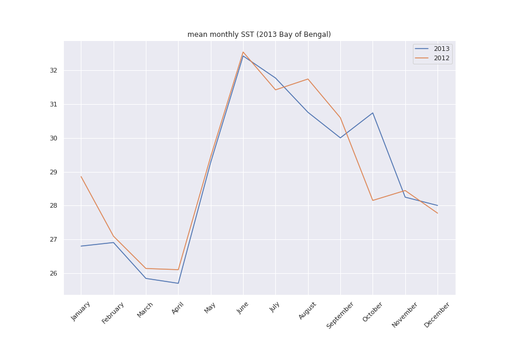
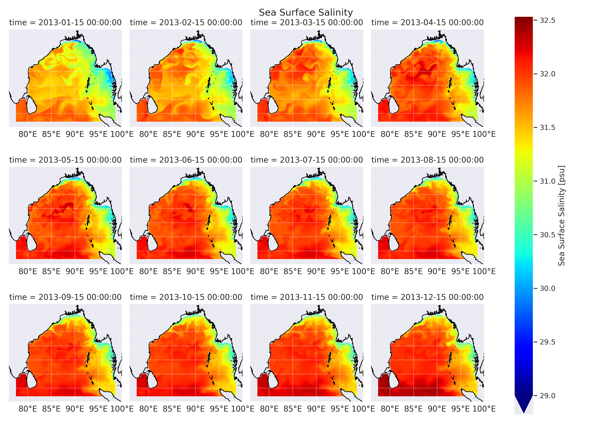
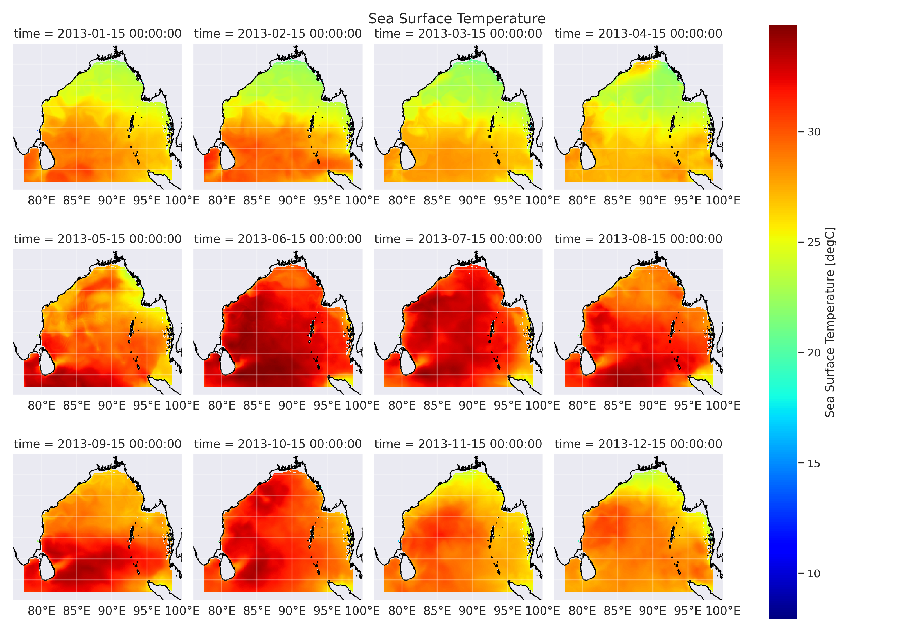
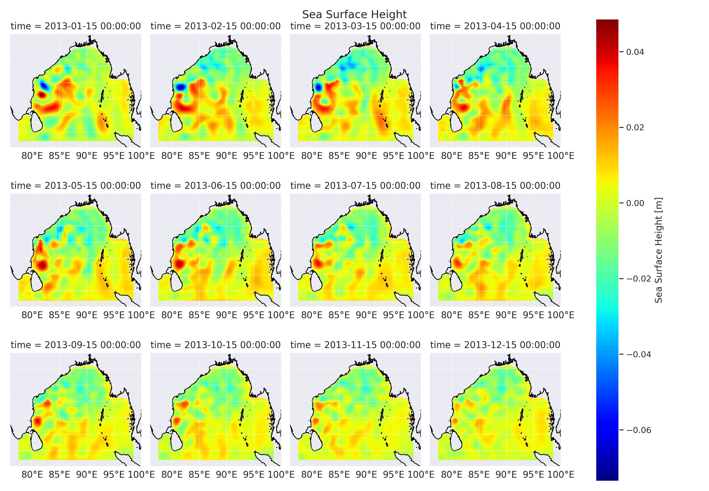

# Run 2 - 2012-2013(2 year)

## Domain setup 

1. Closed boundaries. Fake rigid wall is setup in all open boundaries
2. All the mosaic files are made using FRE-NC tools

## Initial conditions 

1. HYCOM 41 level initial conditions are used 
2. 2012-01-01-00:00:00

## Run parameters 

1. 2 year (2012 and 2013) and 1st year is considered as warm up period (720 days in total)
2. Simulation took approx 12 hours to complete

## Boundary conditions 

1. Since all 4 walls are closed ,  simulation will run in closed boundary condition

1. Datasets from ERA5-reanalysis
   1. wind ,U10 and V10
   2. temp , T at 2 meters
   3. specific humidity 
   4. sea level pressure
   5. precipitation dataset prepared (but not included in this simulation)

All the units, and attributes in match with the MOM6 (MOM5, since MOM6 does not have any official guidline for creating forcing datasets) requirements

## Simulation outputs 

## SST mean (area average)

- Area average on 15th of every month (not monthly average)

## Salinity

## Temperature

## Sea surface height

> Times based interactive plots are also attached with this pdf

# Open boundary condition Simulation

## Boundary Condition Setup 

