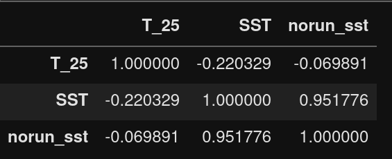

---
title: "Model Configuration"
date: "2022-02-01"
titlepage: False
titlepage-text-color: "FFFFFF"
titlepage-rule-color: "360049"
titlepage-rule-height: 0
titlepage-background: "background.pdf"
table-use-row-colors : true
...

The model used is recent version of Geophysical Fluid Dynamics Laboratory (GFDL), which is publicaly available in the NOAA-GFDL public domain. Modular ocean model version 6 (MOM6) is a hydrostatic, primitive equation, free surface,Boussinesq ocean model with ALE vertical grid remapping to use any kind of vertical coordinates and generalized orthogonal horizontal coordinates. Equations governing ocean dynamics and thermodynamics are discretized on a fixed eulerian grid, with Arkawa C grid defining the horizonatal arrangement of model variables.

## Model Grid and Domain

The model setup has a uniform horizontal resolution 0.036 degrees in longitude and 0.036 degrees in latitude and model domain covers the bay of bengal between latitudes 4N to 25N and longitudes 77E to 99E. For simulating with closed boundaries, the area between latitudes 4N and 4.5 N is closed with fake rigid wall. Model topography is based on 1-min resolution ETOPO1 dataset with minimum depth of ocean as 5m and maximum depth of 5000m.  

The model has 41 vertical levels (HYCOM) and spacing gradually increases up to 5000m and MOM6's vertical lagrangian remapping enabled for using any kind of coordinates. 

All 4 sides are treated as solid rigid walls among them southern wall is fake rigid boundary. 
The bottom topography is based on new version of ETOPO (ETOPO version 1).

| Field | Data Source | References | Frequency |
| ---   | --- | --- | --- | 
| Air Temperature (K) | ERA 5 Interim reanalysis | The ERA5 Global Reanalysis  Hersbach, H. et al. May 2020. QJRMS | daily |
| Short wave Downward flux (W/m^-2) | ERA 5 Interim reanalysis | The ERA5 Global Reanalysis  Hersbach, H. et al. May 2020. QJRMS | daily |
| Longwave downward flux  (W/m^-2) | ERA 5 Interim reanalysis | The ERA5 Global Reanalysis  Hersbach, H. et al. May 2020. QJRMS | daily |
| Specific Humidity  | ERA 5 Interim reanalysis | The ERA5 Global Reanalysis  Hersbach, H. et al. May 2020. QJRMS | daily |
| 10m U wind (m/s)| ERA 5 Interim reanalysis | The ERA5 Global Reanalysis  Hersbach, H. et al. May 2020. QJRMS | daily |
| 10m V wind (m/s)| ERA 5 Interim reanalysis | The ERA5 Global Reanalysis  Hersbach, H. et al. May 2020. QJRMS | daily |
| Precipitation  | ERA 5 Interim reanalysis | The ERA5 Global Reanalysis  Hersbach, H. et al. May 2020. QJRMS | daily |
| Runoff flux  | GRUN |GRUN: An observations-based global gridded runoff dataset from 1902 to 2014 | monthly |
| Sea Level Pressure | ERA5 interim reanalysis | The ERA5 Global Reanalysis  Hersbach, H. et al. May 2020. QJRMS | daily |

## Model Physics options

Among a number of options available in MOM6 the following options are choosed for this model setup, McDougall et al. [2003] nonlinear equation of state has been used, with in situ density as a function of the local potential temperature, salinity and hydrostatic pressure. The tracer advection scheme is the Quicker scheme documented
by Holland et al. [1998]. Neutral tracer physics includes Redi neutral diffusion according to Griffies et al. [1998],and Gent-McWilliams stirring according to the Griffies [1998] skew-flux method. Vertical mixing scheme is the KPP scheme of Large et al. [1994] with nonlocal mixing

The turbulent heat fluxes (sensible and latent heat flux) and the upward longwave flux are calculated as a function of model SST.Temperature and salinity are allowed to evolve freely without any restoration to climatological values

## Forcing

Forcing datasets derived from The ERA5 Global Reanalysis  Hersbach, H. et al. May 2020. QJRMS and observational global runoff data (GRUN) *[ Ghiggi, G., Humphrey, V., Seneviratne, S. I., and Gudmundsson, L.: GRUN: an observation-based global gridded runoff dataset from 1902 to 2014, Earth Syst. Sci. Data, 11, 1655–1674, https://doi.org/10.5194/essd-11-1655-2019, 2019.]* . More about the forcing data is listed in the table 1

The model spin up was started with Initial conditions from HYCOM high resolution model output (HYCOM) with SST,U,V currents and SSS from 1 st January 2012. The model is forced by daily climatology derived from ECMWF reanalysis for the period 2012-2013. The sea-ice ,land and atmospheric components are turned on for all model runs. The first year (2012) is considered as cold run while the second year model is assumed to be stable.

## Model Outputs (2012-2013,with river runoff)

## Comparison plots and analysis
> T_25 is the observational SST
 
Compared locations

### 1st location

### Temp

### Salinity

### U current

### V current

### 2nd location

### Temp

### Salinity

### U current

### Vcurrent

### 3rd location

### Temp

### Salinity

### U current

### V current

- overall an negative correlation between observational and model output SST
- Comparitively simulations with river runoff (and precipitation) are more closer to the observed values.
- after Jun/July the model values start to approach observational values 
- Even the values are close, poor correlation suggests model does not picking up the patterns
- A run for 6 or 7 year might make the model stable (2007-2013)

- The V and U current an acceptable positive correlation of 0.48