The model setup has a uniform horizontal resolution 0.036 degrees in longitude and 0.036 degrees in latitude and model domain covers the bay of bengal between latitudes 4N to 25N and longitudes 77E to 99E. Equations deriving ocean dynamics and themodynamics are discronetized on a eulerian grid, with arkawa C grid defining horizontal arrangement of model variables.  

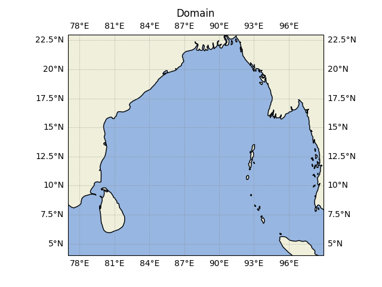

The model has 41 vertical levels (HYCOM) and spacing gradually increases up to 5000m and MOM6's vertical lagrangian remapping enabled for using any kind of coordinates. 

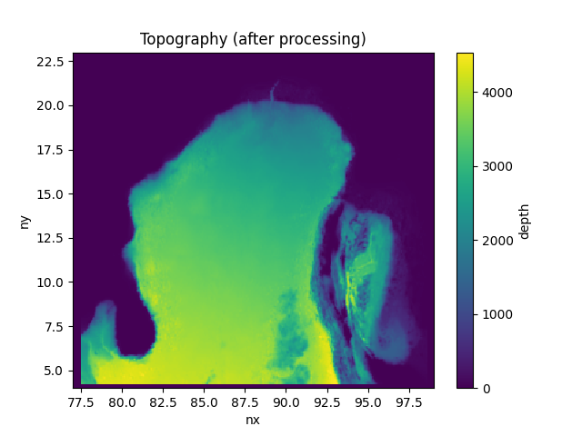

All 4 sides are treated as solid rigid walls among them southern wall is fake rigid boundary. 
The bottom topography is based on new version of ETOPO (ETOPO version 1).

Equation of state used in the model is based on *Wright (1997)*. Vertical mixing uses the KPP scheme with nonlocal mixing. Chlorophyll schemes are not used for estimating shortwave penetration.

| Field | Data Source | References | Frequency |
| ---   | --- | --- | --- | 
| Air Temperature (K) | ERA 5 Interim reanalysis | The ERA5 Global Reanalysis  Hersbach, H. et al. May 2020. QJRMS | daily |
| Short wave Downward flux (W/m^-2) | ERA 5 Interim reanalysis | The ERA5 Global Reanalysis  Hersbach, H. et al. May 2020. QJRMS | daily |
| Longwave downward flux  (W/m^-2) | ERA 5 Interim reanalysis | The ERA5 Global Reanalysis  Hersbach, H. et al. May 2020. QJRMS | daily |
| Specific Humidity  | ERA 5 Interim reanalysis | The ERA5 Global Reanalysis  Hersbach, H. et al. May 2020. QJRMS | daily |
| 10m U wind (m/s)| ERA 5 Interim reanalysis | The ERA5 Global Reanalysis  Hersbach, H. et al. May 2020. QJRMS | daily |
| 10m V wind (m/s)| ERA 5 Interim reanalysis | The ERA5 Global Reanalysis  Hersbach, H. et al. May 2020. QJRMS | daily |
| Precipitation  | ERA 5 Interim reanalysis | The ERA5 Global Reanalysis  Hersbach, H. et al. May 2020. QJRMS | daily |
| Runoff flux  | GRUN |GRUN: An observations-based global gridded runoff dataset from 1902 to 2014 | monthly |
| Sea Level Pressure | ERA5 interim reanalysis | The ERA5 Global Reanalysis  Hersbach, H. et al. May 2020. QJRMS | daily |

The model spin up was started with Initial conditions from HYCOM high resolution model output (HYCOM) with SST,U,V currents and SSS from 1 st January 2012. The model is forced by daily climatology derived from ECMWF reanalysis for the period 2012-2013. The sea-ice ,land and atmospheric components are turned on for all model runs. The first year (2012) is considered as cold run while the second year model is assumed to be stable.

## Model Physics options

Vertical mixing scheme is the KPP scheme of Large et al. [1994] with nonlocal mixing

## Model Outputs (2012-2013,with river runoff)

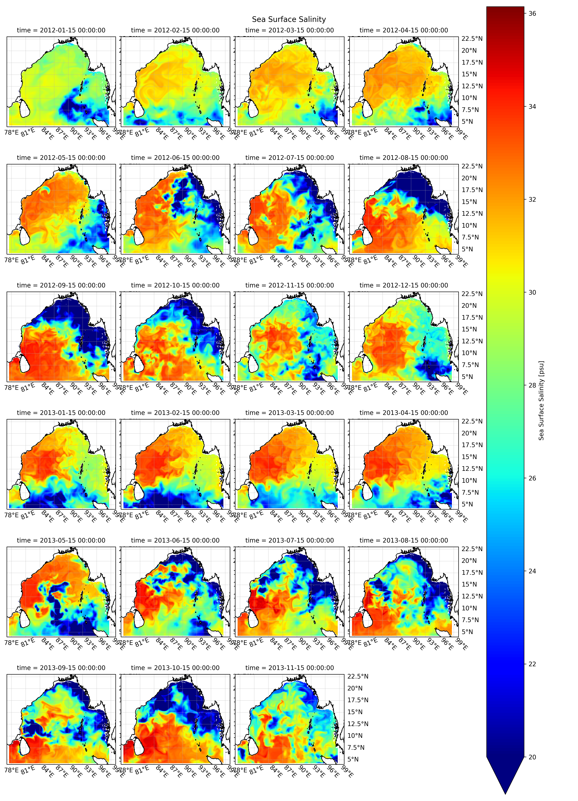

## Comparison plots and analysis
> T_25 is the observational SST
 
Compared locations

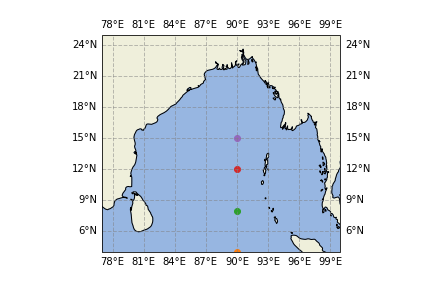

### 1st location

### Temp
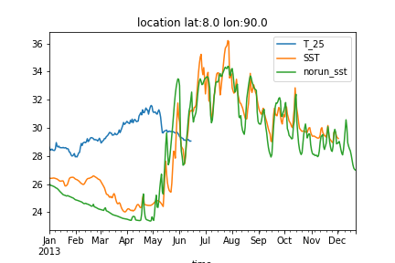

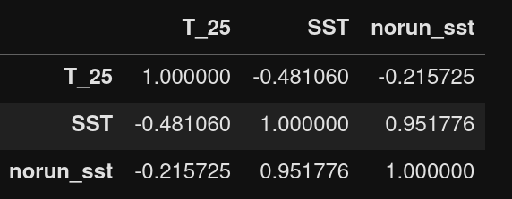

### Salinity

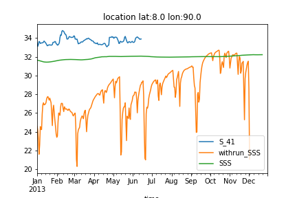

### U current

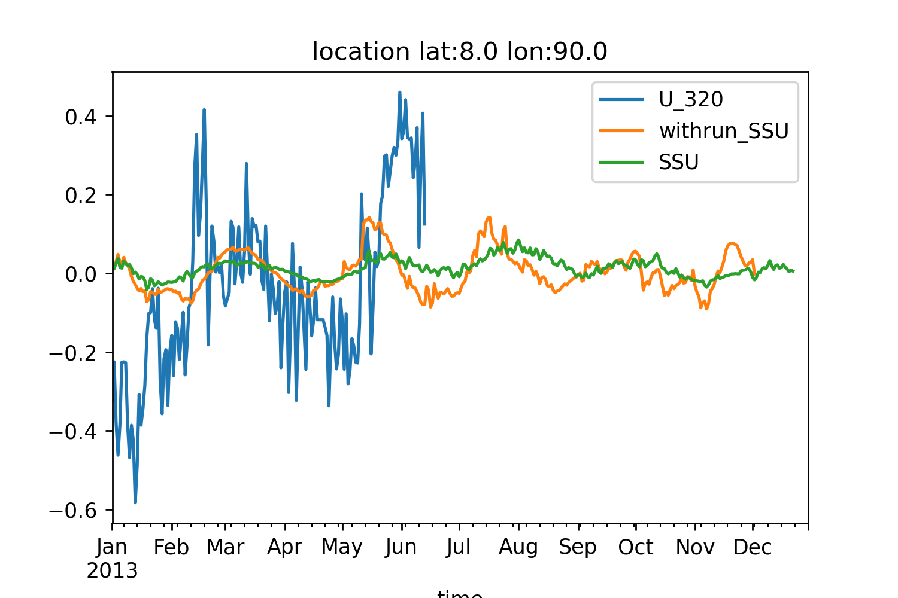

### V current

### 2nd location

### Temp

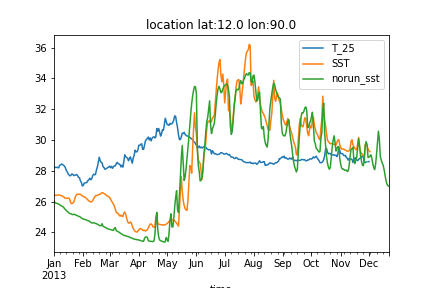

### Salinity

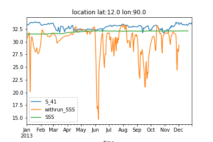

### U current
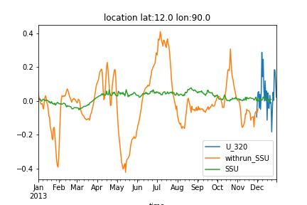

### Vcurrent
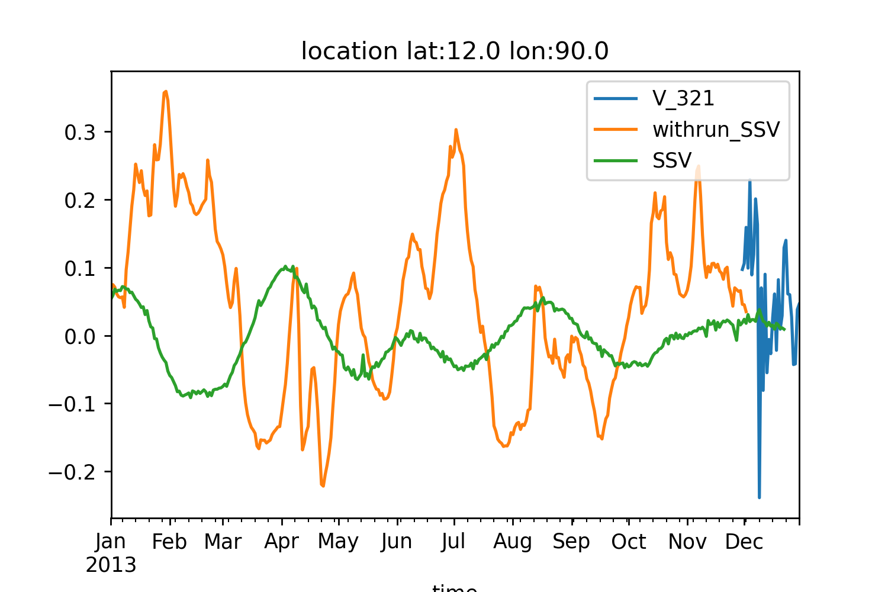

### 3rd location

### Temp

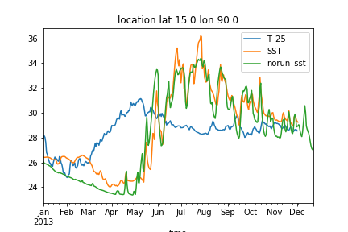
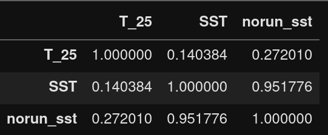

### Salinity

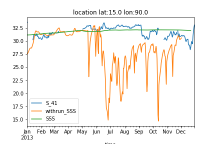

### U current

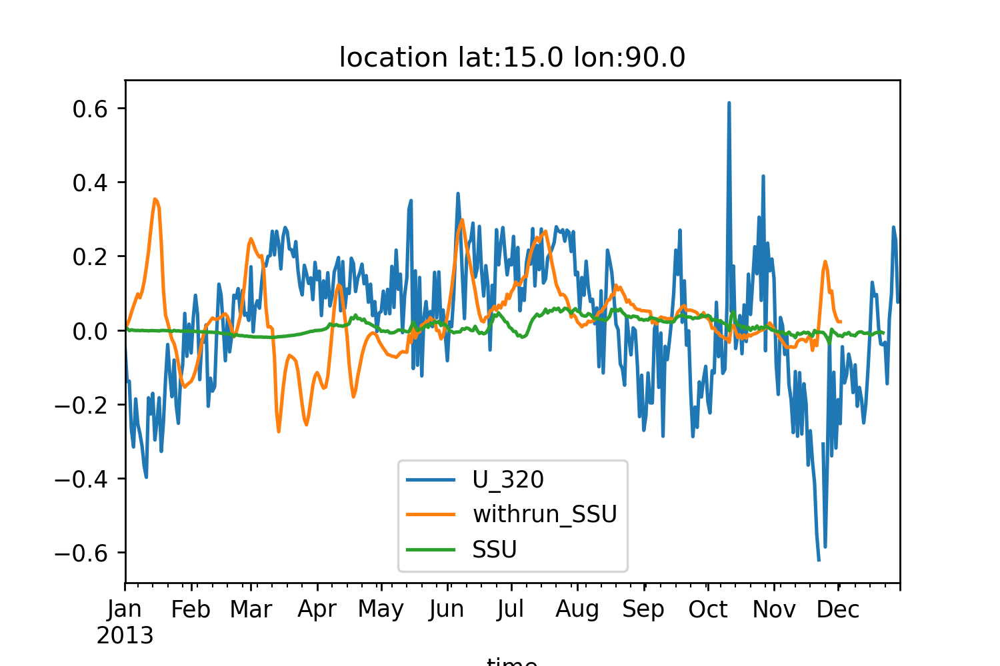

### V current
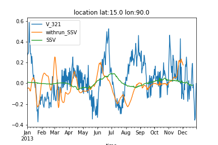

- overall an negative correlation between observational and model output SST
- Comparitively simulations with river runoff (and precipitation) are more closer to the observed values.
- after Jun/July the model values start to approach observational values 
- Even the values are close, poor correlation suggests model does not picking up the patterns
- A run for 6 or 7 year might make the model stable (2007-2013)

- The V and U current an acceptable positive correlation of 0.48