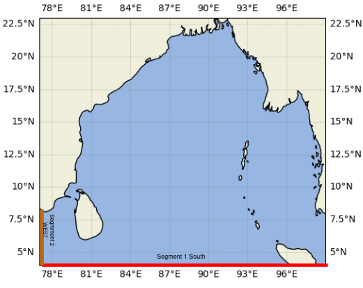
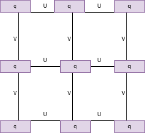
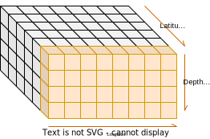

1. Creating an complete obc input datasets of
   1. SST
   2. U
   3. V
   4. Temp
   5. SSH
2. Slicing for required region and time
3. From Hgrid file making points for obc grid objects
   1. Southern edge
   2. Western edge

---

4. Regridding the input data to grid objects 
5. filling over z levels
6. Creating a seperate nc datasets for south and west boundaries
7. Creating dz for each variables
8. Interpolating and regridding input vertical grid to model grid system
9. Save the netcdf file


---


## Preparing Open Boundary Conditions for MOM version 6

### Open boundaries
- It is the “water-water” boundary between the ocean waters of the model domain with the surrounding water. An open boundary condition allows waves to pass out of the region without reflection


---
##### OBC segments




---



---



---

## Code Overview

1. create input datasets (U,V,SSH,S,T)

```python
ds = xr.merge([uu,vv,salt,ssh,temp])
```

2. boundary regional grid object

```python


xgrid = grid.x[::2,::2]
ygrid = grid.y[::2,::2]

south = xr.Dataset()

south['lon'] = xgrid.isel(nyp=0)
south['lat'] = ygrid.isel(nyp=0)

```

---

3. Regrid functions to regrid input data to regional grid

```python
v_south = regrid_south(ds_cut['v'])
u_south = regrid_south(ds_cut['u'])
temp_south = regrid_south(ds_cut['temp'])
ssh_south = regrid_south(ds_cut['eta_t'])
salt_south = regrid_south(ds_cut['salt'])

```

4. Fill values in z levels

```python
drowned_v_south = v_south.ffill(dim='nxp').ffill(dim='st_ocean')
drowned_u_south =u_south.ffill(dim='nxp').ffill(dim='st_ocean')
drowned_temp_south = temp_south.ffill(dim='nxp').ffill(dim='st_ocean')
drowned_salt_south = salt_south.ffill(dim='nxp').ffill(dim='st_ocean')
drowned_ssh_south = ssh_south.ffill(dim='nxp')

```
---
5. creating dz data for each variable

```python

cur_depth = south_obc.zl.values

reg_south_obc = south_obc.interp(zl=hy_depth)


south_dz_new = np.array
(len(reg_south_obc.xh.values)*
[np.array(len(reg_south_obc.yq.values)*
[np.array(len(reg_south_obc.time.values)*
[np.insert(np.diff(hy_depth),
                                                                                      0,1)])])])


```

---

6. time axis correction

```ferret
use nsouth.nc
define axis/t=1-jan-2012:31-dec-2013:1/units=days/calendar
=noleap/t0=31-dec-2011 time

let v11_segment_001 = v[gt=time@asn]
let u11_segment_001 = u[gt=time@asn]
let pt_segment_001 = temp[gt=time@asn]
let s_segment_001 = salt[gt=time@asn]
let ssh_segment_001 = ssh[gt=time@asn]
let dz_v11_segment_001 = dz_v[gt=time@asn]
let dz_u11_segment_001 = dz_u[gt=time@asn]
let dz_s_segment_001 = dz_salt[gt=time@asn]
let dz_pt_segment_001 = dz_temp[gt=time@asn]
set mem/size=2000
sp rm -f nsouth_only.nc
save/file=nsouth_only.nc/append 
v11_segment_001,u11_segment_001,pt_segment_001
,s_segment_001,ssh_segment

```


