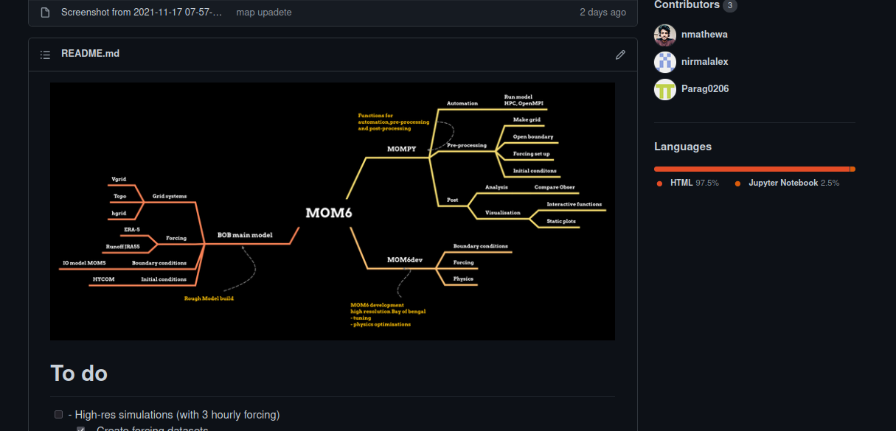

## Aim 

- Configure and setup high-resolution ocean model for bay of bengal region 

## Model overview

- **Geophysical Fluid Dynamics Laboratory (GFDL) MOM6** 
- publicly available in the NOAA-GFDL public domain. (GIT)
-  Modular ocean model version 6 (MOM6) is a hydrostatic, primitive equation, free surface,Boussinesq ocean model with **ALE vertical grid remapping** to use any kind of vertical coordinates and generalized orthogonal horizontal coordinates.
-   Equations governing ocean dynamics and thermodynamics are discretized on a fixed eulerian grid, with **Arkawa C grid** defining the horizontal arrangement of model variables

---

- 0.036 degrees resolution
- 4N , 25N and 77E to 99E
- 1-min ETOPO1
- 41 levels vertical resolution (HYCOM)
- max depth of 5000m

---

---

## Progress

