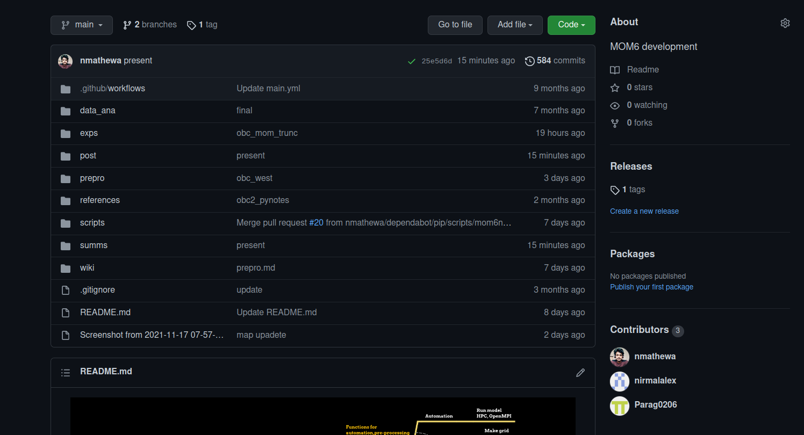

## Aim 

- Configure and setup high-resolution ocean model for bay of bengal region 

## Model overview

- **Geophysical Fluid Dynamics Laboratory (GFDL) MOM6** 
- publicly available in the NOAA-GFDL public domain. (GIT)
-  Modular ocean model version 6 (MOM6) is a hydrostatic, primitive equation, free surface,Boussinesq ocean model with **ALE vertical grid remapping** to use any kind of vertical coordinates and generalized orthogonal horizontal coordinates.
-   Equations governing ocean dynamics and thermodynamics are discretized on a fixed eulerian grid, with **Arkawa C grid** defining the horizontal arrangement of model variables

---

---

# Domain

- 0.062 degrees resolution
- 4N , 25N and 77E to 99E
- 1-min ETOPO1
- 41 levels vertical resolution (HYCOM)
- max depth of 5000m

---

# Boundary Conditions

- 3 boundaries were considered
- One closed and two open boundaries
- The input data for boundaries are from Indian ocean model simulation (MOM5)  

---

## Track and progress

---

---

## Overview of simulations

---

---

---

---

---

# Next steps

## Short term

- A good amount of experimentation's needed with open boundary
- comparison of namelist and physics option with previous runs
- using 1 hourly high resolution forcing (temp,slp,u and v)

## Long term

- Increasing the resolution and tests
