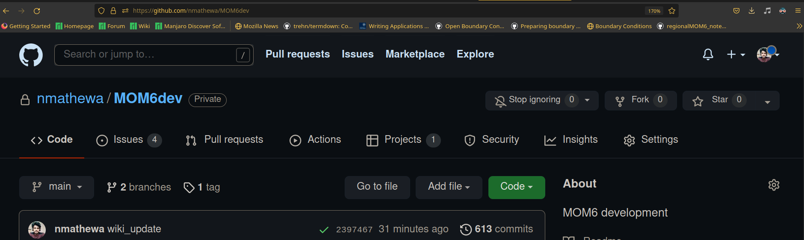

This is documentation of tools used 


# GIT 

## Installation

```
sudo apt-get install git
```


## Clone an repo



```
git clone https://github.com/nmathewa/MOM6dev

```

## Setup

```
git config --global user.name “[firstname lastname]”

git config --global user.email “[valid-email]”
```


## PUSH for Local changes to remote

ACP - Add,Commit,Push

1. Add files to the queue (stage files)
```
git add --all
```

2. Commit the final changes 

```
git commit -m "First changes"
```

3. Push to remote server (git)

```
git push
```


## Cheat-sheet

[Basic GiT commands](resources/git-cheat-sheet-education.pdf)


# TMUX

With Tmux we can easily switch between multiple programs in one terminal, detach them and reattach them to a different terminal

# CONDA